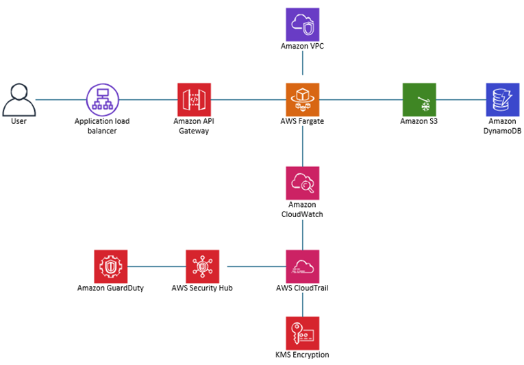
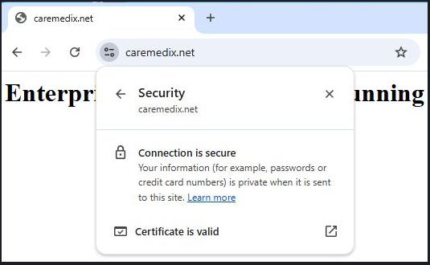
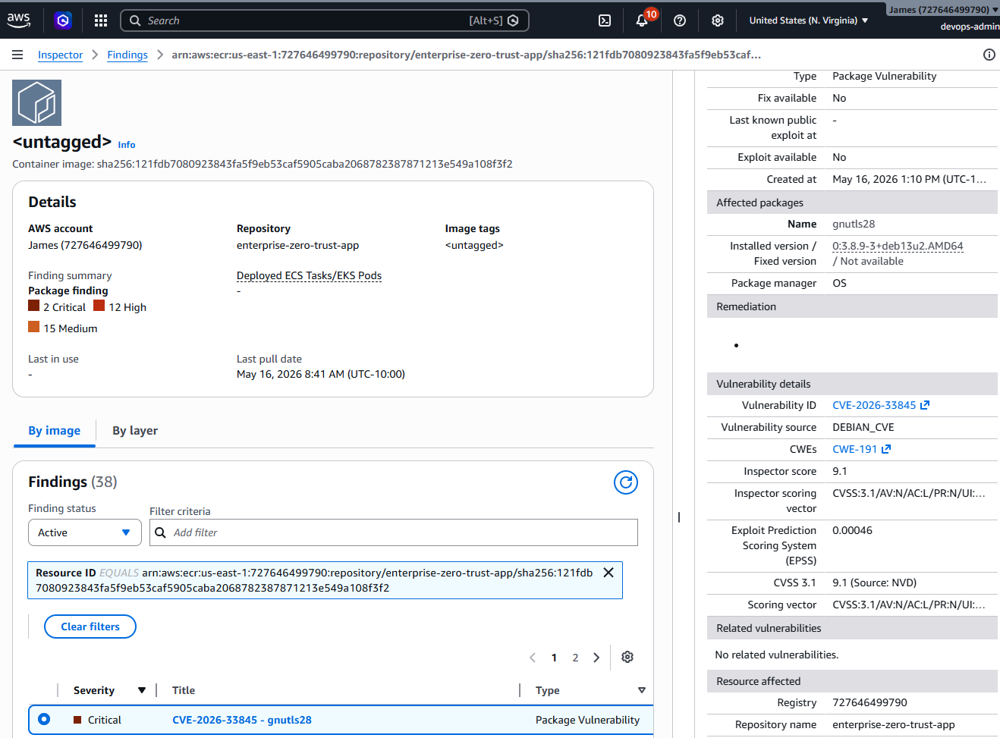
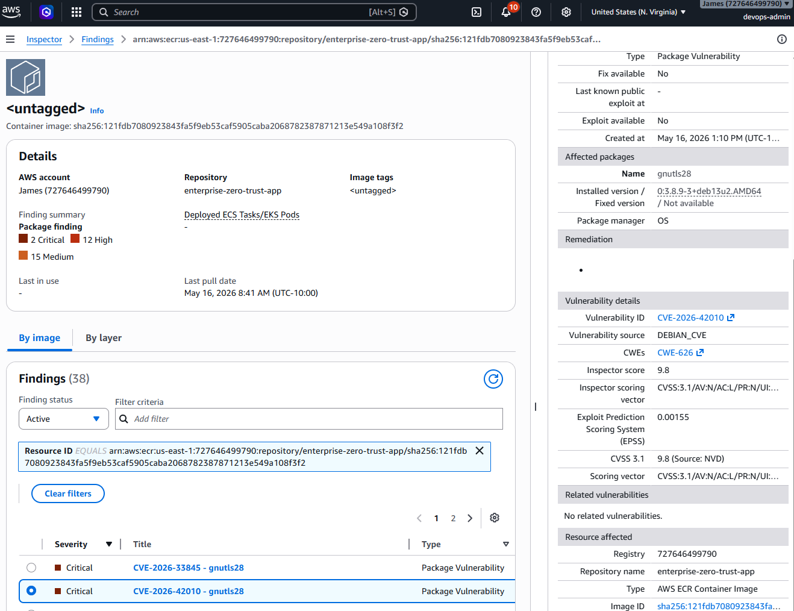

# AWS Zero Trust Architecture

## Overview

This project demonstrates an enterprise AWS Zero Trust Architecture using ECS Fargate, Application Load Balancer, AWS WAF, AWS KMS, GuardDuty, Security Hub, and CloudTrail.

The architecture follows Zero Trust security principles by implementing private networking, encryption, threat detection, centralized logging, HTTPS protection, and container security within AWS.

---

## Architecture Diagram



---

## Architecture Explanation

**Step 1:** The user accesses the application through the internet.

**Step 2:** The Application Load Balancer securely distributes user traffic to the application.

**Step 3:** Amazon API Gateway manages and protects incoming application requests.

**Step 4:** AWS Fargate runs the application automatically without requiring physical servers.

**Step 5:** Amazon VPC provides a secure and private network environment for the application.

**Step 6:** Amazon S3 securely stores files, documents, and application content.

**Step 7:** Amazon DynamoDB stores and manages application data at scale.

**Step 8:** Amazon CloudWatch monitors application performance and system activity.

**Step 9:** AWS CloudTrail tracks account and system actions for auditing and security visibility.

**Step 10:** AWS Security Hub centralizes and reviews security alerts across the environment.

**Step 11:** Amazon GuardDuty continuously detects suspicious activity and potential threats.

**Step 12:** AWS KMS encrypts sensitive data to protect information and support security compliance.

---

## Secure Application Website



**Note:** The application is securely accessible over HTTPS using AWS Certificate Manager (ACM) with a valid TLS certificate. This ensures encrypted communication between users and the application while protecting sensitive data in transit.

---

## AWS Services

- Amazon VPC
- ECS Fargate
- Amazon ECR
- Application Load Balancer (ALB)
- AWS WAF
- AWS KMS
- Amazon CloudWatch
- AWS CloudTrail
- Amazon GuardDuty
- AWS Security Hub
- Amazon S3
- Amazon DynamoDB
- AWS Certificate Manager (ACM)
- Route 53

---

## Security Features

- Private application subnets
- HTTPS/TLS encryption
- AWS WAF web protection
- Threat detection with GuardDuty
- Centralized monitoring with Security Hub
- CloudTrail auditing and logging
- AWS KMS encryption
- Containerized workloads with ECS Fargate
- ECR image vulnerability scanning

---

## Security Validation Screenshots

### AWS WAF Block Logs


**Note:** AWS WAF Block Logs show that AWS WAF successfully detected and blocked suspicious or malicious web traffic before it reached the application. The logs provide visibility into blocked requests, matched security rules, source information, and threat activity for monitoring and security analysis.

---

### Security Hub Finding — CVE-2026-33845



**Note:** AWS Security Hub detected the CVE-2026-33845 vulnerability during container image scanning. The finding provides visibility into potential security risks and helps identify vulnerabilities that require remediation to improve the overall security posture.

---

### Security Hub Finding — CVE-2026-42010



**Note:** AWS Security Hub detected the CVE-2026-42010 vulnerability during container image scanning. The finding highlights potential security exposure and helps support vulnerability management, remediation, and continuous security monitoring across the AWS environment.

---

### Remediation Success


**Note:** The remediation process successfully resolved the identified container vulnerabilities by rebuilding and redeploying the Docker image using a secure and updated base image. This demonstrates continuous vulnerability management and improved security posture within the AWS environment.

---

## Architecture Flow

1. User traffic enters through the Application Load Balancer.
2. AWS WAF filters malicious requests.
3. HTTPS traffic is secured using AWS Certificate Manager.
4. ECS Fargate runs containers inside private subnets.
5. Amazon S3 securely stores application content.
6. DynamoDB stores application data.
7. CloudWatch and CloudTrail monitor activity and logging.
8. GuardDuty and Security Hub provide threat detection and security findings.
9. AWS KMS encrypts sensitive resources and logs.

---

## Repository Structure

```text
src/
images/
docs/
scripts/
README.md
architecture.md
deployment-guide.md
security-controls.md
lessons-learned.md
```

---

## Deployment

See:

- deployment-guide.md
- architecture.md
- security-controls.md

---

## Lessons Learned

- Built an enterprise-style AWS Zero Trust Architecture
- Secured workloads using private networking
- Configured HTTPS with ACM
- Implemented AWS WAF protection
- Monitored threats using GuardDuty and Security Hub
- Improved Docker container security
- Used AWS logging and monitoring services for auditing and visibility

---

## References

- AWS Management Console: https://aws.amazon.com/console/
- ALB: https://docs.aws.amazon.com/elasticloadbalancing/latest/application/introduction.html
- Amazon API Gateway: https://docs.aws.amazon.com/apigateway/latest/developerguide/welcome.html
- Amazon VPC: https://docs.aws.amazon.com/vpc/latest/userguide/what-is-amazon-vpc.html
- AWS Fargate: https://aws.amazon.com/fargate/
- Amazon S3: https://docs.aws.amazon.com/AmazonS3/latest/userguide/Welcome.html
- DynamoDB: https://docs.aws.amazon.com/mobile/sdkforxamarin/developerguide/dynamodb.html
- Amazon CloudWatch: https://aws.amazon.com/cloudwatch/
- Amazon GuardDuty: https://aws.amazon.com/guardduty/
- AWS Security Hub: https://docs.aws.amazon.com/securityhub/latest/userguide/what-is-securityhub-v2.html
- AWS CloudTrail: https://docs.aws.amazon.com/awscloudtrail/latest/userguide/cloudtrail-user-guide.html
- AWS KMS: https://docs.aws.amazon.com/kms/latest/developerguide/overview.html

---

## Author

James Banday

GitHub: https://github.com/jbanday808

LinkedIn: https://www.linkedin.com/in/james-allen-morta-banday-62a391128/

---
